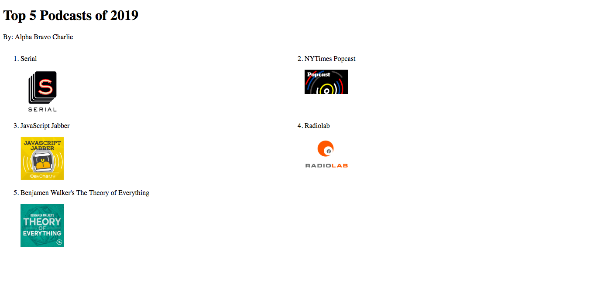
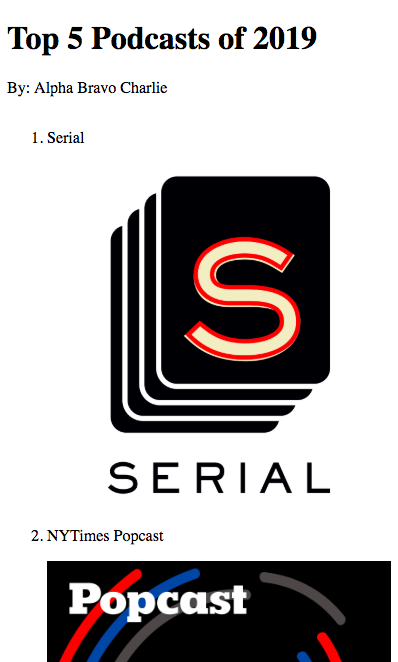

# 3A- Review: HTML, CSS

## Mini Project A: 

**Goal:**

Your goal is to recreate the following wireframe:  

For Part A, you'll be asked to come up with the HTML markup that recreates the structure of the design. This is a common task for front-end developers: the designers on your team and your PM might hand you wireframes and designs, and your job is then to translate that into code. The first step is to figure out the HTML structure you want. 

You have 45 minutes to complete this task. **For this part, you should only be concerned with HTML. Don't worry about the visual look of the wireframe. Just make sure your structure makes sense**

**Image Assets:**

1. https://serialpodcast.org/sites/all/modules/custom/serial/img/serial-itunes-logo.png
2. https://static01.nyt.com/images/2011/05/20/multimedia/music-popcast/music-popcast-videoSixteenByNineJumbo1600-v3.jpg
3. https://devchat.tv/wp-content/uploads/2016/04/javascript_jabber_thumb.jpg
4. https://i1.sndcdn.com/avatars-000002829552-ln24rt-t500x500.jpg
5. https://static1.squarespace.com/static/57f5390f5016e1da21c4bbdf/582a29c215d5dbb8582d3d2d/585813ce37c5817ab5c6f2ca/1482167475113/showcard_toe.jpg

You'll want to start with something like this in your *index.html* file. 
```html
<html>
  <head></head>
  <body>
    /** Your markup goes here **/
  </body>
</html>
```


## Mini Project B: 

**Goal:**

Your goal in Project B is to attempt to replicate the *visual* look of the wireframe design as closely as possible using CSS rules. 

Part 1: The wireframe reference is the same as Project A.

Part 2: 
For Part 2, the breakpoint the designer has requested is 480px. 
